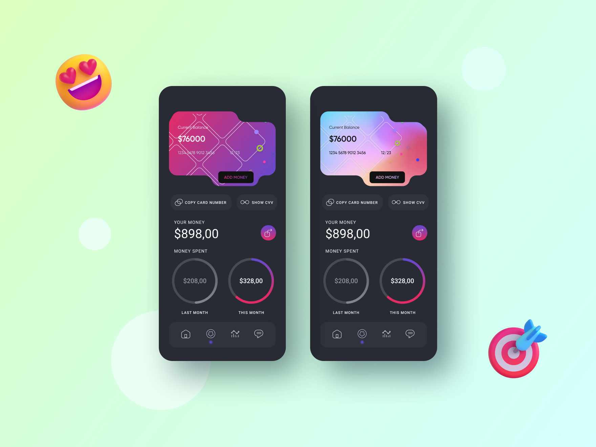

# Верстка мобильного приложения на React + SCSS

### Запуск
1. Установить зависимости проекта `npm i`
2. Запустить проект `npm start`
3. Production сборка `npm run build`

**[🔥 ► Сообщество: Программисты на чиле](https://boosty.to/tonyshow/purchase/1703549?ssource=DIRECT&share=subscription_link)**

